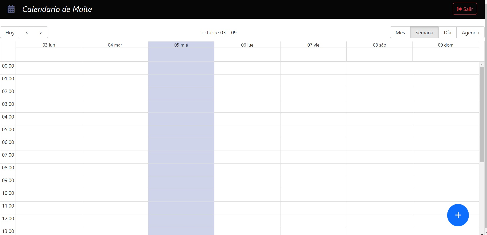

▸Aplicacion Calendario personal

Creada para facilitar y mejorar la organizacion de los usuarios.
Cuenta con un registro, inicio de sesión y cerrar sesión.
Creacion de nuevos eventos los cuales se les puede agregar fecha con horario de inicio y termino, como tambien un titulo y descripcion.
los eventos se pueden visualizar por mes, día, semana y en una especie de agenda, estos se pueden actualizar y eliminar. 

▸Realizado en MERN 
-MongoDB
-Express JS
-React JS
-Node JS

▸Inicialización
-Front-end ➞ (yarn dev)
-Back-end ➞ (npm run dev)

